# Architecture Diagrams

This document groups the main architecture diagrams for DB Assistant. The diagrams are rendered as SVG assets for reliable Markdown visualization, and the Mermaid source files are kept next to this document for maintenance.

## Component and Layer Diagram

Source: [component-diagram.mmd](./component-diagram.mmd)

## Class Diagram

Source: [class-diagram.mmd](./class-diagram.mmd)

