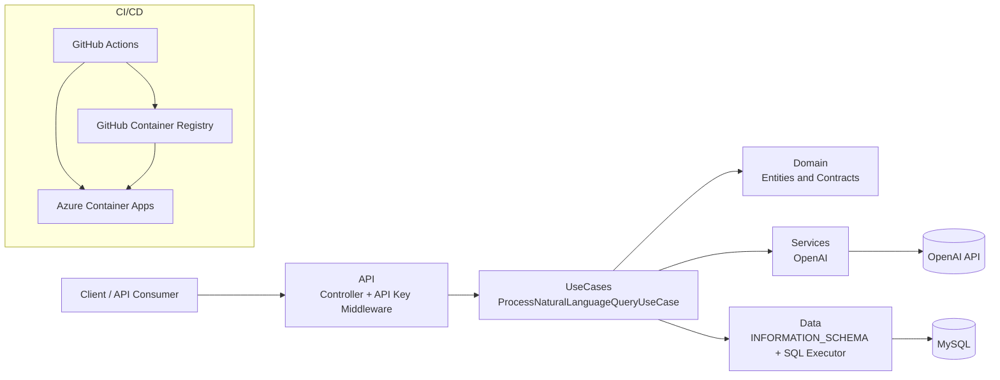

# Architecture Diagrams

This document groups the main architecture diagrams for DB Assistant. The Mermaid source files are the authoritative version and are kept next to this document for maintenance and regeneration.

## Component and Layer Diagram

Source: [component-diagram.mmd](./component-diagram.mmd)

## Class Diagram

Source: [class-diagram.mmd](./class-diagram.mmd)

```mermaid
classDiagram
    class AssistantController {
      +QueryAsync(request, cancellationToken)
    }

    class IProcessNaturalLanguageQueryUseCase {
      +ExecuteAsync(request, cancellationToken)
    }

    class ProcessNaturalLanguageQueryUseCase {
      -ISchemaContextAssembler _schemaContextAssembler
      -ISqlGenerationGateway _sqlGenerationGateway
      -ISqlQueryExecutor _sqlQueryExecutor
      +ExecuteAsync(request, cancellationToken)
    }

    class ISchemaContextAssembler {
      +BuildAsync(question, cancellationToken)
    }

    class SchemaContextAssembler {
      -IInformationSchemaReader _informationSchemaReader
      +BuildAsync(question, cancellationToken)
    }

    class ISqlGenerationGateway {
      +GenerateSqlAsync(question, schemaContext, cancellationToken)
      +GenerateResultsAsTextAsync(question, sql, executionResult, cancellationToken)
    }

    class OpenAiSqlGenerationGateway {
      +GenerateSqlAsync(question, schemaContext, cancellationToken)
      +GenerateResultsAsTextAsync(question, sql, executionResult, cancellationToken)
    }

    class ISqlQueryExecutor {
      +ExecuteReadOnlyAsync(sqlStatement, cancellationToken)
    }

    class MySqlQueryExecutor {
      +ExecuteReadOnlyAsync(sqlStatement, cancellationToken)
    }

    class IInformationSchemaReader {
      +ReadSchemaAsync(cancellationToken)
    }

    class InformationSchemaReader {
      +ReadSchemaAsync(cancellationToken)
    }

    class SqlStatement {
      +Value
      +Create(rawSql)
    }

    AssistantController --> IProcessNaturalLanguageQueryUseCase
    ProcessNaturalLanguageQueryUseCase ..|> IProcessNaturalLanguageQueryUseCase
    ProcessNaturalLanguageQueryUseCase --> ISchemaContextAssembler
    ProcessNaturalLanguageQueryUseCase --> ISqlGenerationGateway
    ProcessNaturalLanguageQueryUseCase --> ISqlQueryExecutor

    SchemaContextAssembler ..|> ISchemaContextAssembler
    SchemaContextAssembler --> IInformationSchemaReader

    OpenAiSqlGenerationGateway ..|> ISqlGenerationGateway
    MySqlQueryExecutor ..|> ISqlQueryExecutor
    InformationSchemaReader ..|> IInformationSchemaReader
    MySqlQueryExecutor --> SqlStatement
```

