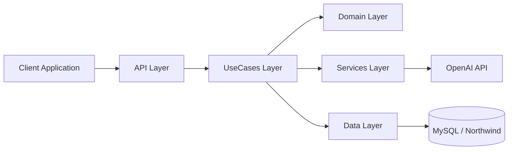

# Solution Overview

## Architecture
The solution follows a layered structure aligned with Clean Architecture and DDD:

- `Domain`: core validation and repository contracts.
- `UseCases`: orchestration of natural-language-to-SQL workflows.
- `Data`: schema discovery and read-only MySQL execution.
- `Services`: OpenAI integration.
- `Api`: REST controllers and Swagger surface.

## First Flow
1. The client sends a natural language question to the API.
2. The use case searches the schema knowledge index (RAG) for relevant business hints, joins, and table guidance.
3. The use case appends the live `INFORMATION_SCHEMA` snapshot as authoritative fallback context, covering tables that are not yet indexed.
4. The OpenAI gateway converts the question into read-only MySQL SQL using the hybrid context.
5. The domain guard validates that only `SELECT` or CTE-based read-only SQL is accepted.
6. When requested, the data layer executes the SQL and returns tabular data.
