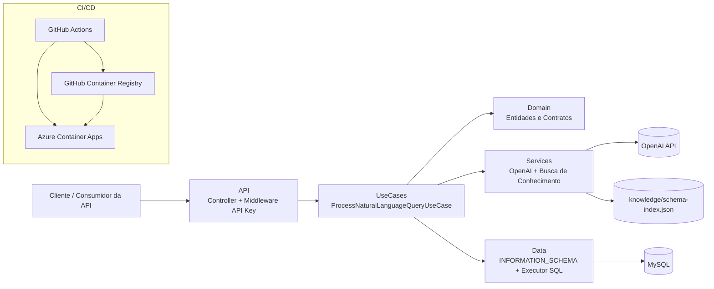

# Diagrama de Arquitetura

Este documento apresenta os principais componentes do sistema e suas comunicações.

## Figura 1 - Diagrama de Componentes/Camadas

```mermaid
flowchart LR
    Client[Cliente / Consumidor da API] --> Api[API\nController + Middleware API Key]
    Api --> UseCases[UseCases\nProcessNaturalLanguageQueryUseCase]
    UseCases --> Domain[Domain\nEntidades e Contratos]
    UseCases --> Services[Services\nOpenAI + Busca de Conhecimento]
    UseCases --> Data[Data\nINFORMATION_SCHEMA + Executor SQL]

    Data --> MySql[(MySQL)]
    Services --> OpenAI[(OpenAI API)]
    Services --> Knowledge[(knowledge/schema-index.json)]

    subgraph CI/CD
        GH[GitHub Actions] --> GHCR[GitHub Container Registry]
        GH --> Azure[Azure Container Apps]
        GHCR --> Azure
    end
```

## Figura 2 - Diagrama de Classes

```mermaid
classDiagram
    class AssistantController {
      +QueryAsync(request, cancellationToken)
    }

    class IProcessNaturalLanguageQueryUseCase {
      +ExecuteAsync(request, cancellationToken)
    }

    class ProcessNaturalLanguageQueryUseCase {
      -ISchemaContextAssembler _schemaContextAssembler
      -ISqlGenerationGateway _sqlGenerationGateway
      -ISqlQueryExecutor _sqlQueryExecutor
      +ExecuteAsync(request, cancellationToken)
    }

    class ISchemaContextAssembler {
      +BuildAsync(question, cancellationToken)
    }

    class SchemaContextAssembler {
      -ISchemaKnowledgeSearchGateway _schemaKnowledgeSearchGateway
      -IInformationSchemaReader _informationSchemaReader
      +BuildAsync(question, cancellationToken)
    }

    class ISqlGenerationGateway {
      +GenerateSqlAsync(question, schemaContext, cancellationToken)
    }

    class OpenAiSqlGenerationGateway {
      +GenerateSqlAsync(question, schemaContext, cancellationToken)
    }

    class ISqlQueryExecutor {
      +ExecuteReadOnlyAsync(sqlStatement, cancellationToken)
    }

    class MySqlQueryExecutor {
      +ExecuteReadOnlyAsync(sqlStatement, cancellationToken)
    }

    class IInformationSchemaReader {
      +ReadSchemaAsync(cancellationToken)
    }

    class InformationSchemaReader {
      +ReadSchemaAsync(cancellationToken)
    }

    class ISchemaKnowledgeSearchGateway {
      +SearchAsync(question, cancellationToken)
    }

    class JsonSchemaKnowledgeSearchGateway {
      +SearchAsync(question, cancellationToken)
    }

    class SqlStatement {
      +Value
      +Create(rawSql)
    }

    AssistantController --> IProcessNaturalLanguageQueryUseCase
    ProcessNaturalLanguageQueryUseCase ..|> IProcessNaturalLanguageQueryUseCase
    ProcessNaturalLanguageQueryUseCase --> ISchemaContextAssembler
    ProcessNaturalLanguageQueryUseCase --> ISqlGenerationGateway
    ProcessNaturalLanguageQueryUseCase --> ISqlQueryExecutor

    SchemaContextAssembler ..|> ISchemaContextAssembler
    SchemaContextAssembler --> ISchemaKnowledgeSearchGateway
    SchemaContextAssembler --> IInformationSchemaReader

    OpenAiSqlGenerationGateway ..|> ISqlGenerationGateway
    MySqlQueryExecutor ..|> ISqlQueryExecutor
    InformationSchemaReader ..|> IInformationSchemaReader
    JsonSchemaKnowledgeSearchGateway ..|> ISchemaKnowledgeSearchGateway

    MySqlQueryExecutor --> SqlStatement
```
